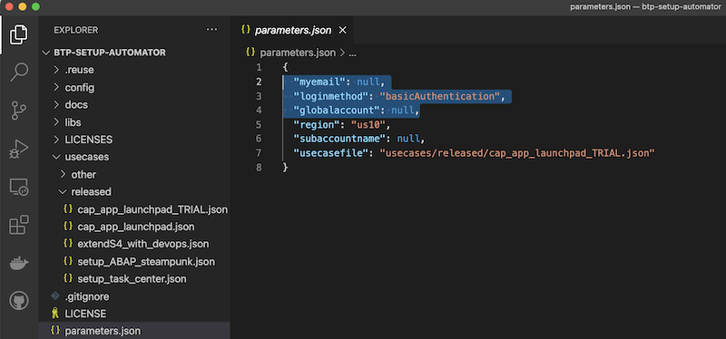

# Using the Dockerfiles in MS Visual Studio Code (VSCode)

In case you are using MS VS Code, you need to open the Command Palette (in the menu "View" select "Command Palette") or press the key combination command, shift, P. Then enter the command:

```text
Remote-Containers: Attach to Running Container
```


Now you should see the running container. Click on it, and a new window will pop-up with the content of the docker container.


You might have to select the right folder in the left hand navigtion of VS Code. Select the **/home/user** folder.


Now the last step is to simply run the script with thw following command:

```bash
python run.py
```

The script will take the parameters defined in the [**parameters.json** file](../parameters.json). By default the [**parameters.json** file](../parameters.json) is pointing to [a use case definition that sets up and deploys a full-stack CAP application on a BTP trial account](../usecases/released/cap_app_launchpad_TRIAL.json). But of course you can use other use case files in the [**usecases** folder](../usecases/) or even create your own use case file, by taking the existing ones as a blueprint.



## Authentication

As you have to login to the BTP account you have to be authenticated. By default basic authentication is used for the BTP and Cloudfoundry CLI. Bu if you prefer you can set the parameter **loginmethod** to **basicAuthentication** in the **parameters.json** file and the script will ask you to click on a URL when a login is needed (you have to open a browser with the link).

## Available parameters

The python script allows you to use parameters to configure it to your needs and make it better usable within other scripts and/or ci-cd pipelines. Just run the following command to get a list of the available commands:

```bash
python run.py -h
```

## Using different use case configurations

The folder **usecases** has several sample use case configurations that you can use with the script. By using the parameter **-usecase** you can tell the script to use another file than the default use case. Simply type the following command:

```bash
python run.py -usecase "usecases/released/usecase_cap-app-launchpad.json"
```

and the usecase will be executed to run the full-stack CAP application on a productive (e.g. Pay-per-Use) BTP account.

If you want you can as well use your own use case files that you can copy into the corresponding **usecases** folder BEFORE creating the docker image.

## Scripting btp-setup-automator

As the BTP-setup-automator is running in Docker there is a lot of potential to integrate it in other scripts that can call it.

E.g. the developers behind BTP-setup-automator test various use case configurations through a bash script similar to this example:

```bash
#!/usr/bin/env bash

folderLogFile="/your/local/folder/btp-setup-automator/log/$(date "+%Y-%m-%d")/"
mkdir -p "${folderLogFile}"
##########################################################################################################
# Run script with use case definition >unittest01<
# usecase file : >usecases/released/cap_app_launchpad_TRIAL.json<
##########################################################################################################
docker image build  -t "test01":latest -f "config/containerdefinitions/btp-setup-automator/Dockerfile"  .
docker container run --rm  -it -d --name "test01" \
    --mount type=bind,source="${folderLogFile}/",target="/home/user/log/" \
    "test01"

docker exec --workdir "/home/user/" "test01" python run.py 
    -parameterfile 'usecases/other/unittests/parameterfiles/unittest01.json' \
    -logfile       '/home/user/log/test01.log' \
    -metadatafile  '/home/user/log/test01_metadata.json' \
    -globalaccount '12345678trial-ga' \
    -loginmethod   'basicAuthentication' \
    -myemail       'steve.rodgers@starkindustries.com' \
    -mypassword    '$(cat cred.txt)'

docker container stop   test01
docker container wait   test01
docker container rm -f  test01
docker image     rmi -f test01
```

Let's go through this example step-by-step.

### Step1: Create local folder for the logs

First a folder on your local machine is used to let the docker image write the log files into. If the folder doesn't exist, yet, it will be created.

```bash
#!/usr/bin/env bash

folderLogFile="/your/local/folder/btp-setup-automator/log/$(date "+%Y-%m-%d")/"
mkdir -p "${folderLogFile}"
```

### Step 2: Build a docker image for BTP-setup-automator

Afterwards a docker image is build with the name **test01** based on the Dockerfile of BTP-setup-automator:

```bash
docker image build  -t "test01":latest -f "config/containerdefinitions/btp-setup-automator/Dockerfile"  .
```

### Step 3: Start a docker container with the created image

Now the docker container **test01** is created and started for the image **test01** we've created before. To have a look into the log files created by the BTP-setup-automator you mount the local folder of your machine to the folder of the BTP-setup-automator log files.

```bash
docker container run --rm  -it -d --name "test01" \
                        --mount type=bind,source="${folderLogFile}/",target="/home/user/log/" \
                        "test01"
```

### Step 4: Run the BTP-setup-automator

The only thing missing now is to start the script for the BTP-setup-automator that is inside the docker container. You provide all the necessary parameters within a **docker exec** command.

```bash
docker exec --workdir "/home/user/" "test01" python run.py 
    -parameterfile 'usecases/other/unittests/parameterfiles/unittest01.json' \
    -logfile       '/home/user/log/test01.log' \
    -metadatafile  '/home/user/log/test01_metadata.json' \
    -globalaccount '12345678trial-ga' \
    -loginmethod   'basicAuthentication' \
    -myemail       'steve.rodgers@starkindustries.com' \
    -mypassword    '$(cat cred.txt)'
```

Once the script is ready, you can check your BTP global account, if all services and apps are up-and-running as expected. In addition you can check your local folder for the log files that have been created.
> NOTE: in case you want to provide the parameterfile as a link to a parameter file, you can simply do it like this:

```bash
docker exec --workdir "/home/user/" "test01" python run.py 
    -parameterfile 'https://raw.githubusercontent.com/rui1610/btp-automation-experiments/main/btp-setup-automator/parameterfiles/parameters.json' 
```


### Step 5: Clean-up

In a last step you stop the container, and once the container is stopped, you delete the container and delete the image.

```bash
docker container stop   test01
docker container wait   test01
docker container rm -f  test01
docker image     rmi -f test01
```
